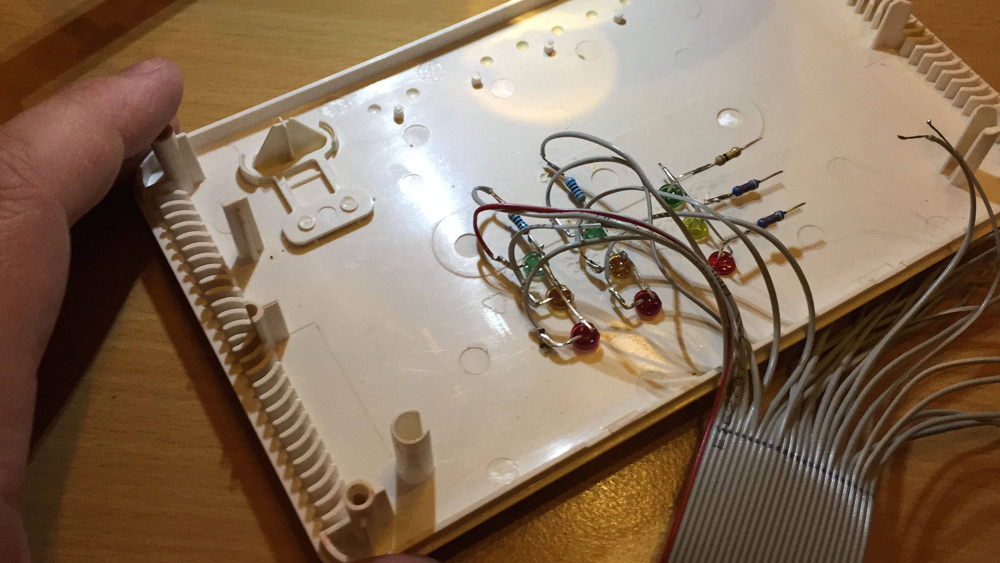
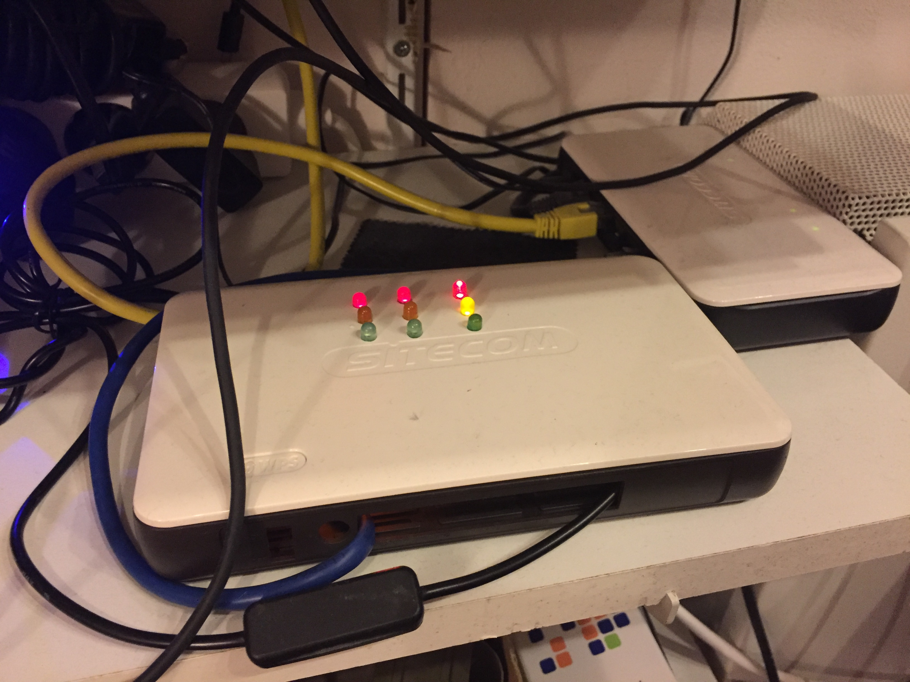

# Nagios RAG

Show RAG (Red Amber Green) status of 
- nagios monitored hosts
- nagios monitored services
- cpu of nagios host

## Project
I've put a raspberry pi into a case of an old sitecom router. 
* Soldering

* Finished

